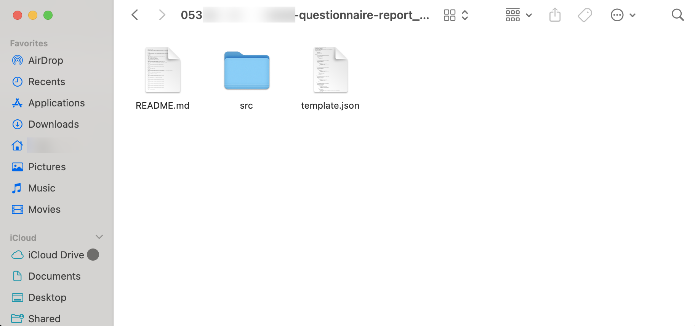
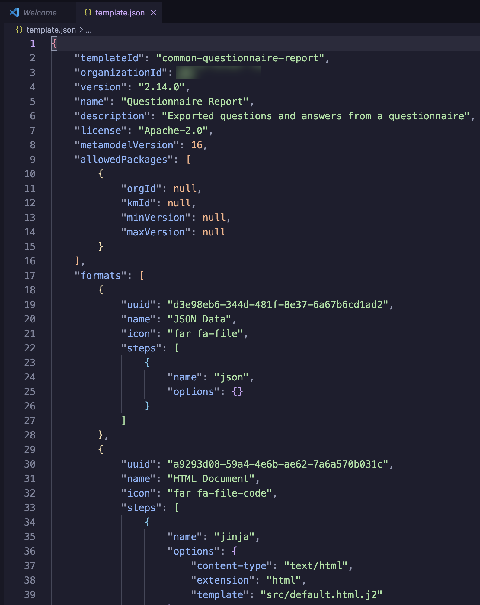

# Document template - popis struktury

## Získání document templatu
- Teď, když jsme si nainstalovali naše TDK, pojďme ho použít! 
- Nejprve si pomocí příkazu `dsw-tdk list` vypišme seznam všech všech document templatů na naší DSW instanci
- Měl by se vám zobrazit seznam všech document templatů. Nejdřív v seznamu, následně v editoru
- Vyberte si ten, který chcete editovat a zkopírujte jeho id (to jméno s pomlčkami)
- Následně si ho můžeme stáhnout. Na to použijeme příkaz `dsw-tdk get <id-naseho-templatu>`
- Pro potřeby popisu a vysvětlení základů Jinjy jsem se se rozhodla použít jako příklad klasický common-questionnaire-report

## Základní struktura
- Pokud vše proběhlo tak, jak mělo, zdánlivě se nic nestalo. Otevřete si složku, ve které pracujete v prohlížeči souborů, nebo si vypište obsah adresáře přes `ls`
- Měli byste vidět podsložku, jejíž název je id daného templatu
- Přesuňte se do ní, ať už v průzkumníku, nebo přes terminál
- Document template obsahuje soubor README, template.json a složku src
- Vypadat by to mělo zhruba takto (Screenshot z MacOS)

 
 
- Soubor README je vaše standardní README, které obsahuje informace o templatu. Jak se template jmenuje, kdo ho vytvořil, seznam změn...
- Kdybyste ho chtěli editovat, jedná se o standardní markdown. Tento soubor se dá úplně stejně editovat i na webu
- Další soubor, template.json je zajímavější. Tento soubor nejde editovat na webu a obsahuje konfiguraci celého templatu
- Otevřete ho ve VSCodu a podívejte se dovnitř. Uvidíte něco velmi podobného tomuto:

 
 
- Tenhle soubor ovládá nastavení celého templatu. Začíná hlavičkou, následně pokračuje strukturou templatu, tedy to, které dokumenty odpovídají čemu (k tomu se dostaneme)
- Zde můžete přepsáním příslušných hodnot změnit třeba jméno templatu, jeho id (prakticky tak můžete vytvořit fork), nebo popisek
- Specificky si ale všimněte klíče na řádku 8 `"MetamodelVersion"`. Přepsáním hodnoty tohoto klíče (tj. toho čísla za dvojtečkou) měníte verzi metamodelu
- Takže pokud dojde k aktualizaci na novou verzi FAIR Wizardu a všechnu Document templaty na vás začnou křičet `Unsupported metamodel`, už nemusíte zoufat. Stačí přepsat hodnotu na hodnotu+1
> Tohle je **hack**. Fakt. Jedná se o rychlý hack, který jenom přepíše verzi metamodelu na novou, ale nedá přístup k novým funkcím, které nový metamodel přináší, jako jsou třeba nové typy otázek, integrací a podobně. 
> Opravdu tohle dělejte jenom v případě, že hasíte požár.