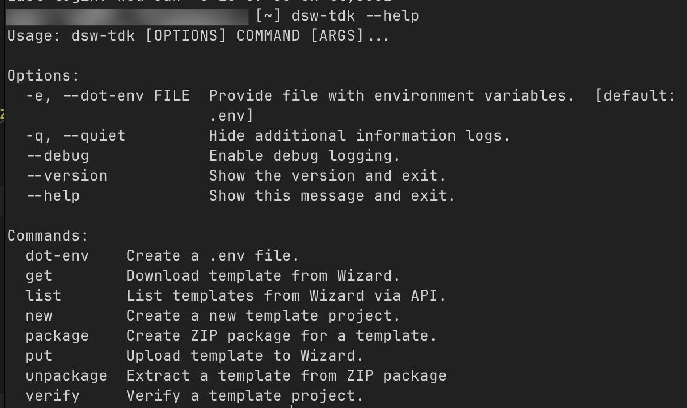

# DSW-TDK - instalace a základní použití

- Jeden z nejsnazších a nejpříjemnějších způsobů, jak upravovat document templaty v rámci Data Stewardship Wizardu/FAIR Wizardu (dále budu používat už jenom zkratku DSW, protože je to kratší) je pomocí CLI (Command line interface) nástroje DSW-TDK
- TDK je tedy nástroj, který se spouští v terminálu a umožňuje automaticky (přes DSW API) stahovat document templaty, testovat změny živě v rámci DSW a následně nahrát upravený document template zpět do aplikace

> Alternativy k použití TDK je a) editovat soubory přímo na webu DSW, v integrovaném editoru, nebo b) ručně stáhnout zip archiv, dekomprimovat ho, zeditovat soubory, znovu zazipovat a ručně nahrát zpátky.
> 
> Editování na webu není nic moc, protože ten integrovaný editor není příliš dobrý, navíc na webu nejde editovat všechno, ruční stahování a opětovné nahrávání je zbytečně zdlouhavé a nechává velký potenciál pro chyby.

- První krok je DSW-TDK nainstalovat

## Instalace DSW-TDK
- Jak už jsem uváděla [tady](../zaklady/instalace_pythonu.md) DSW-TDK není distribuovaný jako instalační/executable soubor, jak jste nejspíš zvyklí, ale jako Python balíček
- Python balíčky jsou Python programy, které si můžete stáhnout a nějak je používat (buď samostatně, jako TDK, nebo jako knihovnu ve vašich vlastních Python programech)
- Abychom mohli TDK používat, musíme mít na našem počítači [nainstalovaný Python](../zaklady/instalace_pythonu.md)
- Následně [otevřete terminál](../zaklady/zaklady_ptace_s_terminalem.md) a napište tam tenhle příkaz `pip install dsw-tdk`

### Co tenhle příkaz dělá? 
- První část `pip` volá Python Package Index. To je další CLI nástroj, který se nainstaloval jako součást Pythonu, který slouží ke stahování Python programů z oficiálního Pythoního repozitáře [PyPi](https://pypi.org)
- Druhá část `install` nám říká, kterou funkci pipu voláme. Install říká, že chceme nainstalovat nový balíček. Kromě instalace bychom mohli chtít balíček třeba smazat, nebo aktualizovat. Pro seznam všech pip příkazů a jak je používat, napište `pip --help` pro nápovědu
- Poslední část `dsw-tdk` nám říká, jaký balíček stáhnout

> Pokud byste někdy chtěli začít programovat v Pythonu a psát svoje vlastní programy, instalovat balíčky takhle globálně je obecně špatný nápad. Funguje to u samostatných programů, jako je DSW-TDK, ale nikdy takhle nestahujte třeba knihovny
> Vždycky, když byste potřebovali nějakou knihovnu stáhnout, omezte jí na jednotlivý projekt pomocí virtuálního prostředí. Hezký úvod do toho, proč a jak používat virtuální prostředí má třeba můj oblíbený [NaucSePython](https://naucsepython.cz)

- Pokud vidíte ve svém terminálu spoustu rychle běžícího textu, který začíná "downloading" tak to je správně. dsw-tdk si stahuje python balíčky, které samo používá
- Ověřte, že se tdk nainstalovalo tím, že do terminálu napíšete `dsw-tdk --help`

## Nastavení prostředí, ověření
- Teď když máme DSW-TDK nainstalové, je potřeba naší DSW instanci nějak říct, že chceme komunikovat přímo s ní a že jsme oprávněný uživatel, který to může
- DSW na tohle používá autentizaci pomocí tokenu
- Buď můžete při každém úkonu, který vyžaduje ověření ručně kopírovat adresu DSW serveru a token, nebo můžete využít pohodlné vychytávky, kterou tdk nabízí - [enviromentální proměnné](https://en.wikipedia.org/wiki/Environment_variable)
- Adresu serveru a autentizační token dostanete od svého admina (v případě FW instance v KNAV tedy ode mě, nebo od Jindřicha)

Pomocí terminálu se [odnavigujte do složky](../zaklady/zaklady_ptace_s_terminalem.md), kam si chcete stáhnout daný document template
> Složka musí být prázdná. Můžete si vytvořit novou pomocí `mkdir`. Pak se do ní přes `cd` odnavigujte.

- Napište příkaz `dsw-tdk --help`

> Jak už jste si možná všimli, příkaz --help je používaný standardně většinou CLI nástrojů k zobrazení nápovědy a seznamu příkazů

Dostanete tohle: 
 

- Všimněte si hned prvního příkazu (pod "Commands") `dot-env`
- Co tenhle příkaz dělá? Tenhle příkaz nám vytvoří skrytý soubor ".env", který slouží k tomu, aby se v něm ukládala tajemství. V našem případě tedy adresa serveru, s kterým chceme komunikovat a token

> **EXTRÉMNĚ DŮLEŽITÉ**: .env soubor, ani token samotný nikam neposílejte, nenahrávejte, nepřenášejte na jiné zařízení, nemějte na sdíleném počítači, nebo cokoliv jiného. Přistupujte k tomu stejně, jako k loginu a heslu do DSW, nebo do Vaší banky
> 
> Kdyby se vám něco tohoto typu stalo (třeba jste, já nevím, pushnuli .env soubur i s tokenem a adresou do veřejného repozitáře na Githubu, ehm) **hned kontaktujte admina vaší instance**, on ten leaknutý token vymaže a vygeneruje vám nový

- Pokud jste ve správné složce, spusťte tedy příkaz pro tvorbu .env souboru - `dsw-tdk dot-env`
- Po chvilce čekání vás terminál vyzve, abyste zadali adresu pro API cally vaší DSW instance. V terminálu se objeví nápis `API URL:` Nakopírujte tam URL adresu, kterou vám poskytnul váš admin a zmáčkněte Enter
- Objeví se druhé pole, které chce vyplnit token, poskytnutý od vašeho admina. `API key:` Vyplňte i to a zmáčkněte "Enter"
- Ověřte, že se úspěšně vytvořil soubor .env pomocí příkazu `ls -a`, který vypíše všechny soubory ve složce, včetně skrytých souborů

