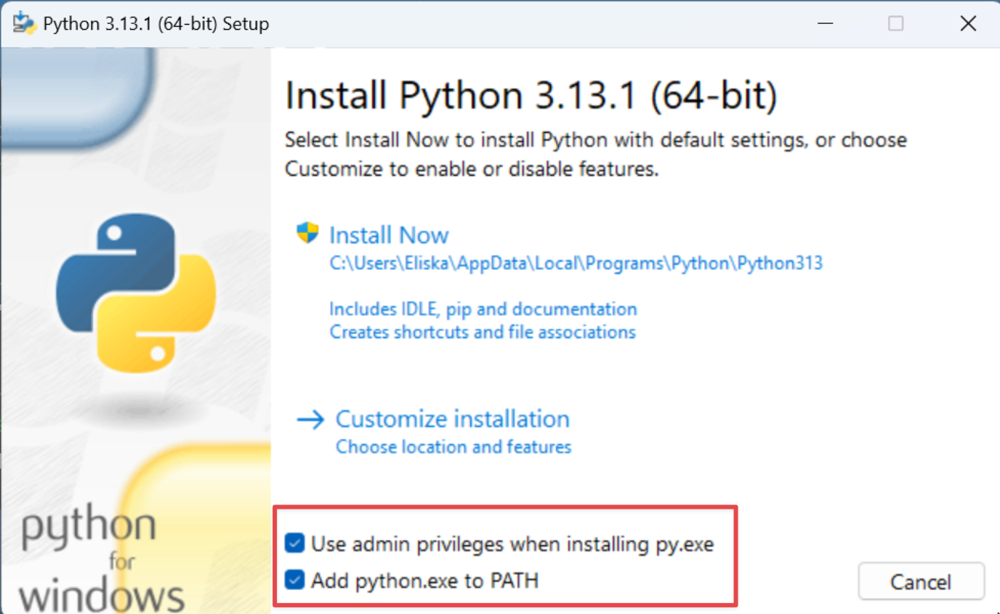

# Instalace Pythonu

K tomu, abychom mohli efektivně pracovat s FAIR Wizardími templaty je potřeba upravovat daný template lokálně, na Vašem počítači. 
Některé věci (třeba změny verze metamodelu) nejdou dělat z webového rozhraní. 

Nejefektivnější způsob, jak stahovat a opětovně nahrávat Document templaty je pomocí CLI nástroje [Data Stewardship Wizard Template Development Kit - zkratka DSW-TDK](https://github.com/ds-wizard/engine-tools/tree/develop/packages/dsw-tdk). 
Ten je napsaný právě v Pythonu a distribuovaný jako Python program. Proto si potřebujeme Python nainstalovat na náš počítač, abychom mohli TDK využívat

## Unix (tj. Linux a MacOS)
- Python už je nainstalovaný
- Ověřte otevřením terminálu (viz [Základy práce s terminálem](zaklady_ptace_s_terminalem.md)) a napsáním příkazu `python3 --version`
- Pokud terminál vypsal zpátky něco jako `$ Python 3.9.13`, Python je úspěšně nainstalovaný

## Windows
- Ověřte, jestli je Python nainstalovaný: Otevřete příkazovou řádku (Windows + R, napište "cmd" a stiskněte Enter. Více viz [tady](zaklady_ptace_s_terminalem.md))
- Do příkazové řádky napište `python`
- Pokud se vám objevilo něco ve stylu příkazu níže, můžete příkazovou řádku zase zavřít a přejít na další krok. Pokud se Windows pokusil otevřím Microsoft Store, zase ho zavřete a pokračujte podle kroků níže
> `Python 3.8.1 (...)
> Type "help", "copyright", "credits" or "license" for more information.`
- Pokud vám místo toho Windows vypsal něco jiného, musíte si Python stáhnout a nainstalovat:
  - Běžte na oficiální stránky [Pythonu](https://python.org) a v hlavičce klikněte na "Download". Stáhněte si verzi pro Váš operační systém
  - Následně otevřete instalační soubor a nainstalujte Python 
  - **Důležité** - Během instalace zaškrtněte "Use admin priviledges" a "Add python.exe to PATH" a pak v posledním kroku klikněte na "Overwrite PATH limit"
  
  

- Dokončete instalaci. Pokud jste to ještě neudělali, zavřete a znovu otevřete příkazovou řádku (cmd.exe) aby se mohla znovu načíst konfigurace. Tímto je Python nainstalovaný
- Ověřte tím, že do příkazové řádky znovu napíšete `python`